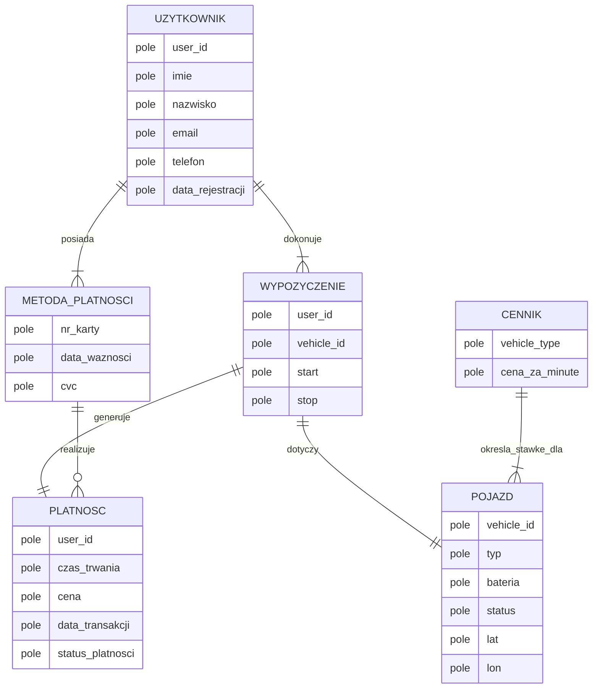

```mermaid
erDiagram
    UZYTKOWNIK ||--|{ METODA_PLATNOSCI : posiada
    UZYTKOWNIK ||--|{ WYPOZYCZENIE : dokonuje
    WYPOZYCZENIE ||--|| POJAZD : dotyczy
    WYPOZYCZENIE ||--|| PLATNOSC : generuje
    METODA_PLATNOSCI ||--o{ PLATNOSC : realizuje
    CENNIK ||--|{ POJAZD : okresla_stawke_dla

    UZYTKOWNIK {
        pole user_id
        pole imie
        pole nazwisko
        pole email
        pole telefon
        pole data_rejestracji
    }

    METODA_PLATNOSCI {
        pole nr_karty
        pole data_waznosci
        pole cvc
    }

    POJAZD {
        pole vehicle_id
        pole typ
        pole bateria
        pole status
        pole lat
        pole lon
    }

    WYPOZYCZENIE {
        pole user_id
        pole vehicle_id
        pole start
        pole stop
    }

    PLATNOSC {
        pole user_id
        pole czas_trwania
        pole cena
        pole data_transakcji
        pole status_platnosci
    }

    CENNIK {
        pole vehicle_type
        pole cena_za_minute
    }
```
