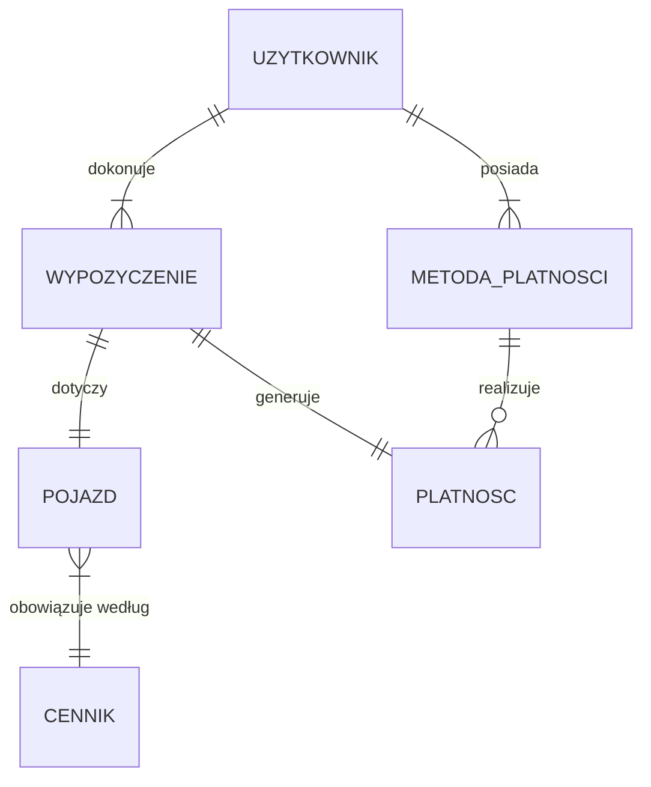

```mermaid
erDiagram
    UZYTKOWNIK ||--|{ METODA_PLATNOSCI : "posiada"
    UZYTKOWNIK ||--|{ WYPOZYCZENIE : "dokonuje"
    WYPOZYCZENIE ||--|| POJAZD : "dotyczy"
    WYPOZYCZENIE ||--|| PLATNOSC : "generuje"
    METODA_PLATNOSCI ||--o{ PLATNOSC : "realizuje"
    POJAZD }|--|| CENNIK : "obowiązuje według"
```